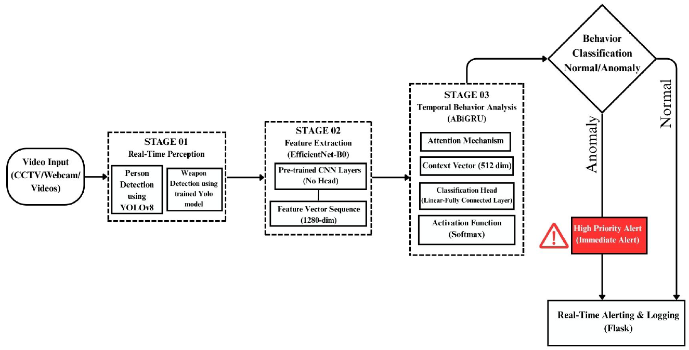
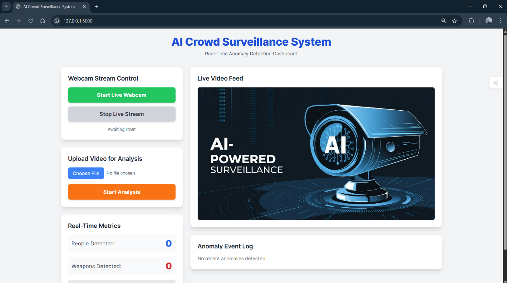
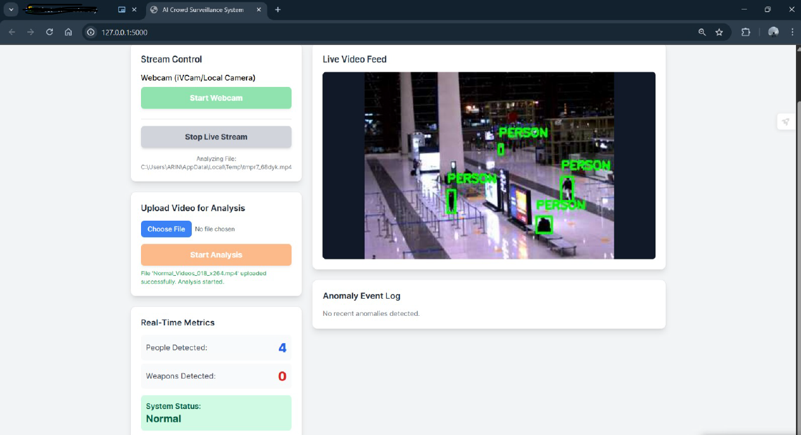
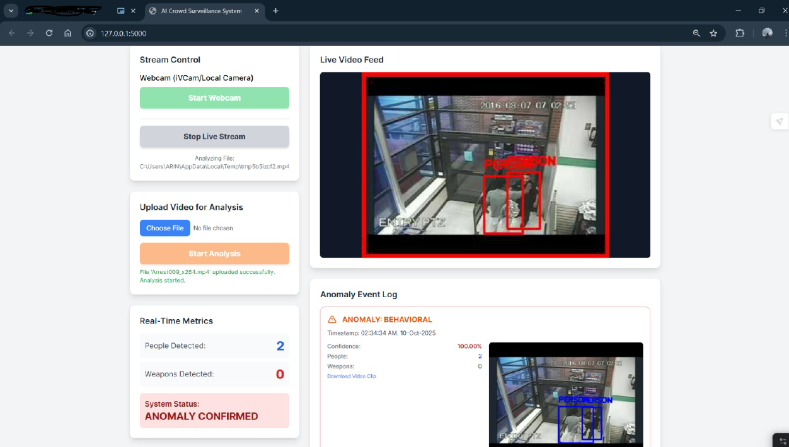
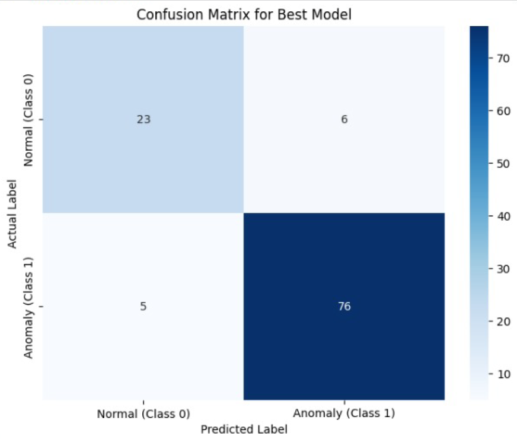

# AI-Based Surveillance System for Crowd Behavior & Riot Detection  
Real-Time Video Analysis using YOLOv8, EfficientNet-B0 & ABiGRU  
Built with Flask • PyTorch • OpenCV

---

## 📌 Overview

This project is an **AI-powered surveillance system** that analyzes **real-time CCTV/IP camera feeds** to detect:

- 👥 People  
- ⚠️ Suspicious movement  
- 🔥 Riot-like or anomalous behavior  

It uses a **three-stage hybrid deep learning pipeline**:

1. **YOLOv8** – Real-time person detection  
2. **EfficientNet-B0** – Spatial feature extraction  
3. **Attention-Bidirectional GRU** – Temporal behavior analysis  

The processed output is displayed live on a **Flask dashboard** with alerts and logs.

---

## ⭐ Features

- Real-time **CCTV / Webcam / IP Camera** processing  
- YOLOv8 for **person & weapon detection**  
- Behavior classification: **Normal / Suspicious / Anomaly**  
- Temporal modeling using **ABiGRU**  
- Live dashboard with metrics  
- Visual bounding boxes on video  
- Alert system with anomaly confirmation  
- Event logging + downloadable clips  

---

## 🔄 Workflow Diagram

---

## 🖥️ Dashboard Screenshots

### Main Dashboard

### Normal Behavior Detected

### Anomaly / Riot Detected

---

## 🧠 Deep Learning Pipeline

### **1. YOLOv8 – Person Detection**
- Detects persons in each frame  
- Outputs bounding boxes  
- Updates real-time metrics  

### **2. EfficientNet-B0 – Spatial Feature Extraction**
- Converts frames → **1280-dim feature vectors**  
- No classification head (pure feature embeddings)

### **3. ABiGRU – Temporal Behavior Classification**
- Input: 100-frame sequences  
- Output: **Normal / Anomaly + confidence**  
- Attention layer improves critical region focus  
- Persistence logic: anomaly must repeat **3 times** to confirm  

---

## 📊 Model Performance (Confusion Matrix)

